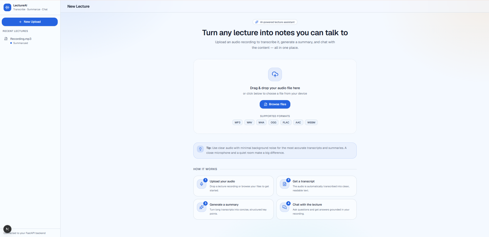
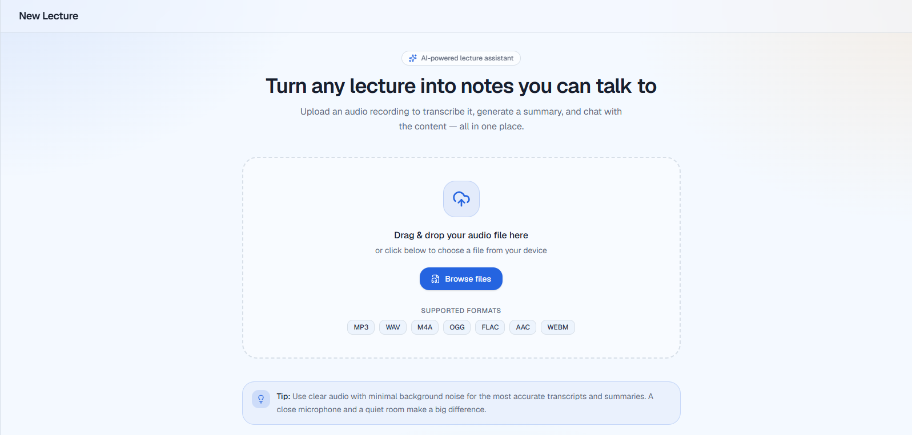
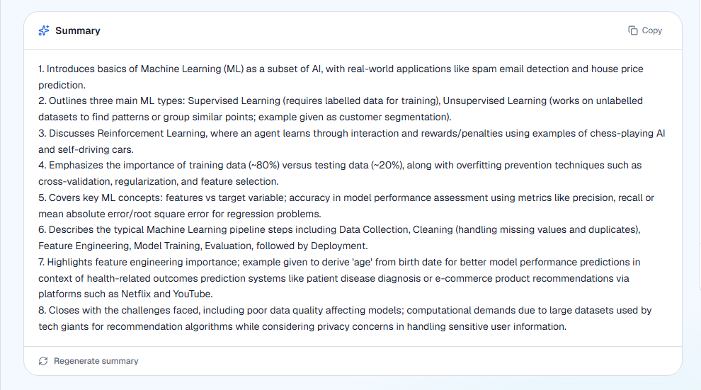
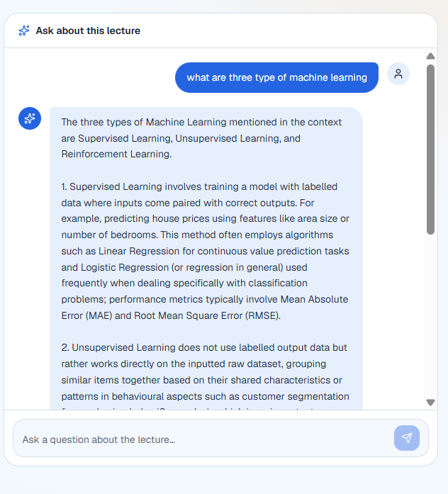
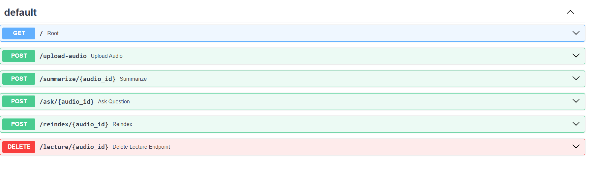

#  Lecture Assistant

An AI-powered Lecture Assistant that converts lecture audio into transcripts, generates concise summaries, and answers questions using Retrieval-Augmented Generation (RAG).

Built with **FastAPI**, **Whisper**, **Ollama**, **ChromaDB**, **Sentence Transformers**, and **Next.js**.

---

##  Features

-  Upload lecture audio files
-  Automatic speech-to-text transcription using Whisper
-  AI-generated lecture summaries
-  Ask questions about the lecture using RAG
-  Local LLM inference using Ollama
-  Semantic search with ChromaDB
-  Modern Next.js frontend
-  MySQL database integration

---

##  Tech Stack

### Backend
- Python
- FastAPI
- Whisper
- Ollama
- ChromaDB
- Sentence Transformers
- LangChain Text Splitters
- MySQL
- SQLAlchemy

### Frontend
- Next.js
- TypeScript
- Tailwind CSS

---

##  Project Structure

```text
lecture_assistant/
│
├── backend/
│   ├── api/
│   ├── services/
│   └── utils/
│
├── database/
│
├── frontend/
│
├── llm/
│
├── prompts/
│
├── rag/
│
├── speech_to_text/
│
├── storage/
│
├── tests/
│
├── config.py
├── main.py
├── requirements.txt
└── README.md
```

---

#  Installation

## 1. Clone Repository

```bash
git clone https://github.com/bhaveshrajput6996/lecture-assistant.git

cd lecture-assistant
```

---

## 2. Create Virtual Environment

Windows

```bash
python -m venv venv

venv\Scripts\activate
```

Linux / macOS

```bash
python3 -m venv venv

source venv/bin/activate
```

---

## 3. Install Dependencies

```bash
pip install -r requirements.txt
```

---

## 4. Install Ollama

Download Ollama from

https://ollama.com/download

Pull the required model

```bash
ollama pull phi3.5
```

Start Ollama

```bash
ollama serve
```

---

## 5. Install FFmpeg

Download FFmpeg and add it to your system PATH.

---

## 6. Configure MySQL

Create a database

```sql
CREATE DATABASE lecture_assistant;
```

Update the database credentials inside

```
config.py
```

---

## 7. Run the Backend

```bash
uvicorn main:app --reload
```

Backend will run on

```
http://127.0.0.1:8000
```

Swagger Documentation

```
http://127.0.0.1:8000/docs
```

---

## 8. Run the Frontend

```bash
cd frontend

npm install

npm run dev
```

---

#  System Architecture

```
Audio Upload
      │
      ▼
Whisper Transcription
      │
      ▼
Transcript Storage
      │
      ▼
Chunking
      │
      ▼
Embeddings
      │
      ▼
ChromaDB
      │
      ▼
Retriever
      │
      ▼
Ollama LLM
      │
      ▼
Answer / Summary
```

---

#  API Endpoints

| Method | Endpoint | Description |
|---------|----------|-------------|
| POST | `/upload-audio` | Upload lecture audio |
| POST | `/summarize/{audio_id}` | Generate summary |
| POST | `/ask/{audio_id}` | Ask questions |

---

##  Application Screenshots

###  Home Page



---

###  Upload Audio



---

###  Generated Summary



---

###  Chat Assistant



---

###  Swagger API



#  Future Improvements

- User Authentication
- PDF Summary Export
- Multi-language Support
- Cloud Deployment
- Streaming Responses
- Speaker Diarization
- Chat History
- Docker Support

---

#  Contributing

Contributions are welcome!

1. Fork the repository
2. Create a new branch
3. Commit your changes
4. Push to your branch
5. Open a Pull Request

---

#  License

This project is licensed under the MIT License.

---

#  Author

**Bhavesh Rajput**

GitHub:
https://github.com/bhaveshrajput6996

---

⭐ If you found this project useful, please consider giving it a star!
